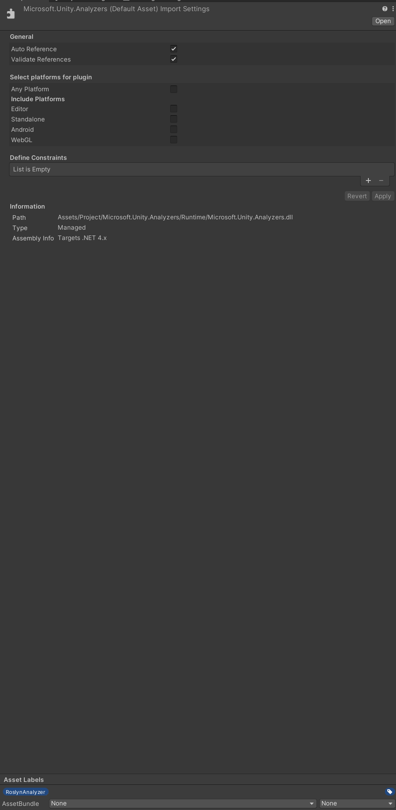
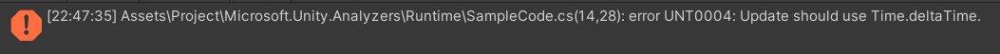

## 概要
Unityで様々なRoslyn Analyzerの導入を検証するためのリポジトリ

## Microsoft.Unity.Analyzers
[Microsoft.Unity.Analyzers](https://github.com/microsoft/Microsoft.Unity.Analyzers)はUnityプロジェクト向けに開発された`GameObject.Find`のような処理のコストが高いメソッドの呼び出しなどを検知し警告などを行えるようにするRoslyn Analyzerです。

### 導入方法
[nuget](https://www.nuget.org/packages/Microsoft.Unity.Analyzers/1.15.0)からパッケージをDLし、.nupkgを.zipに編集し解凍する。
`analyzers\dotnet\cs`以下にある`Microsoft.Unity.Analyzers.dll`を探してUnity Project内に配置する。

導入後、dllのimport settingから下記のように設定する。

- Select platforms for pluginのチェックをすべて外す
- Asset Labelsに`RoslynAnalyzer`を設定する



下記のプラグインを導入して対応したIDEを使用している場合はAnalyzer用のDLLを.csprojに自動で適用してくれるので[CsprojModifier](https://github.com/Cysharp/CsprojModifier)のようなライブラリは不要。
ただし、AdditionalFilesを使用するAnalyzerの場合は引き続き.csproj生成時にAnalyzer用の定義を追加する必要があるので必要。

- JetBrains Rider Editor v2.0.6以降
- Visual Studio Code Editor v1.2.0以降

### rulesetを設定する方法
`Assets`以下に`Default.ruleset`を配置して特定の検知結果をエラーとする。

```text
<?xml version="1.0" encoding="utf-8"?>
<RuleSet Name="Example Rule Set" Description=" " ToolsVersion="10.0">
    <Rules AnalyzerId="Microsoft.Unity.Analyzers" RuleNamespace="Microsoft.Unity.Analyzers">
        <Rule Id="UNT0004" Action="Error" />
    </Rules>
</RuleSet>
```



### 参考リンク
- [【Unity】Unityに既存のRoslyn Analyzerを導入する手順まとめ](https://light11.hatenadiary.com/entry/2022/11/01/193339)
- [Unityプロジェクト向けRoslynアナライザの作りかた](https://swet.dena.com/entry/2021/05/25/100000)